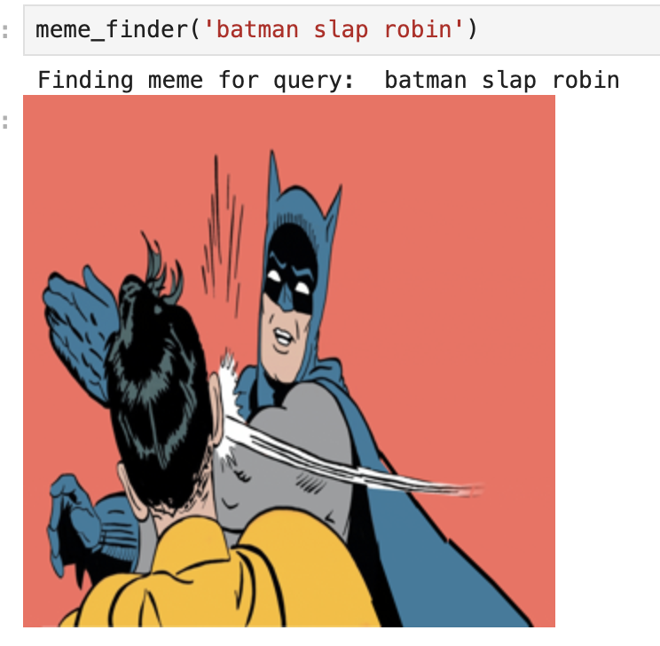
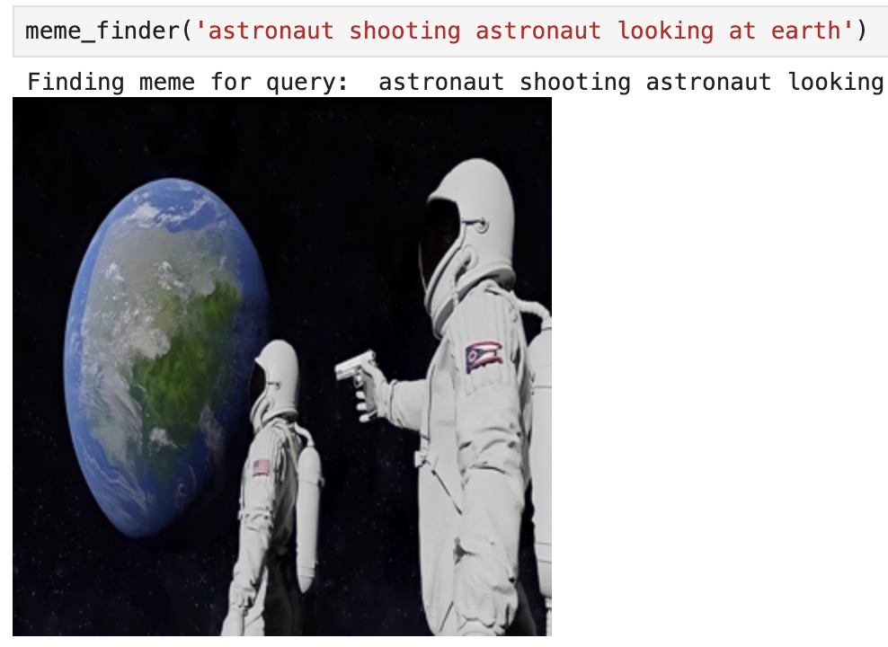
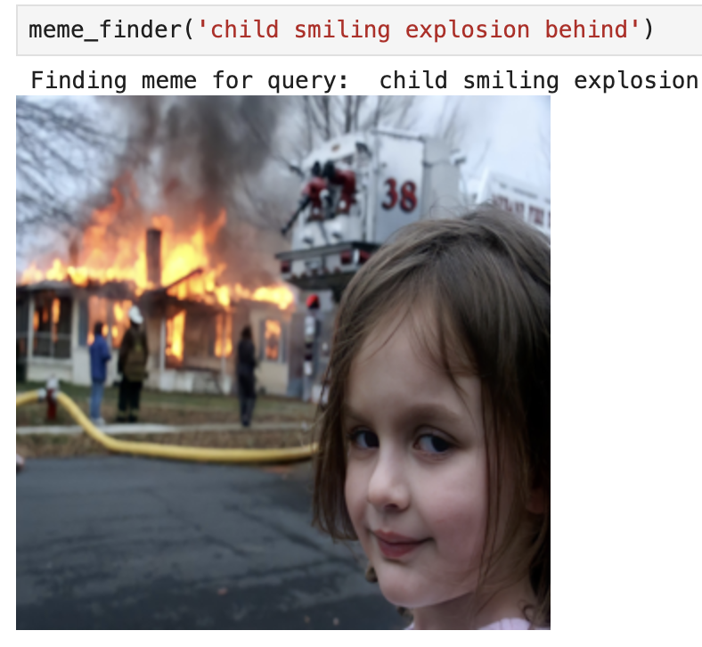

# Meme finder
Open text meme search


# Setup
Clone repo, cd into it and run 
```
make build
```


# Start Jupyter notebook
```
make run
```

# Data Source
https://drive.google.com/drive/folders/1UXKquhbrh_aC48FeqY60TW6YXls9gAMD

Place data in project/data/sample

# Example







