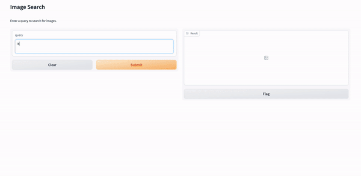
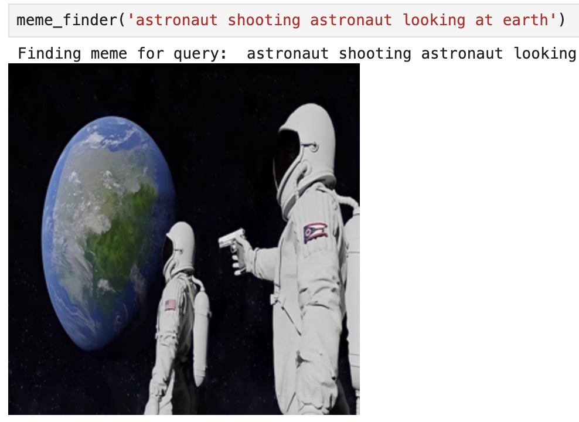

# Media finder
Open text media search




# Setup
Clone repo, cd into it and run 
```
make build
```

# Interface
Start a UI to search for media in repo
```
make interface
```

# Debug/Dev with Jupyter notebook
```
make run
```

# Data Source
https://drive.google.com/drive/folders/1UXKquhbrh_aC48FeqY60TW6YXls9gAMD

Place data in project/data/sample
# Example



